# WhatsRunning
Know what's running on your Android device

 

* Join Telegram support group to get instant updates and test beta releases.

WhatsRunning shows:
- A lot of information about native processes and Android apps running on your device
- A detailed breakdown of RAM and swap usage
- System services
- Scheduled jobs
- Auto-starting apps
- Wake locks
- Battery sippers

For more information please see [Guide and FAQs](https://mirfatif.github.io/WhatsRunning/help/help).

## Required Privileges / Permissions

* WhatsRunning requires <b>root</b> or at least <b>ADB</b> privileges.
* <b>android.permission.INTERNET</b> is required to use ADB over network. The only connections made outside the device are to check for app updates, to fetch help contents, and to do license verification (on Pro version).

## Privacy Policy

[Privacy Policy](https://mirfatif.github.io/WhatsRunning/PRIVACY)

## Screenshots

 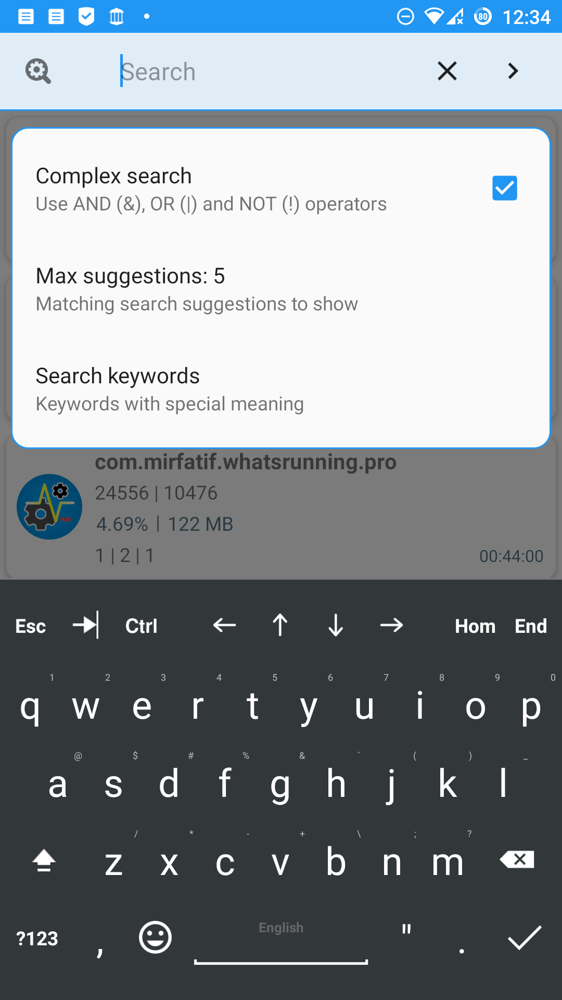 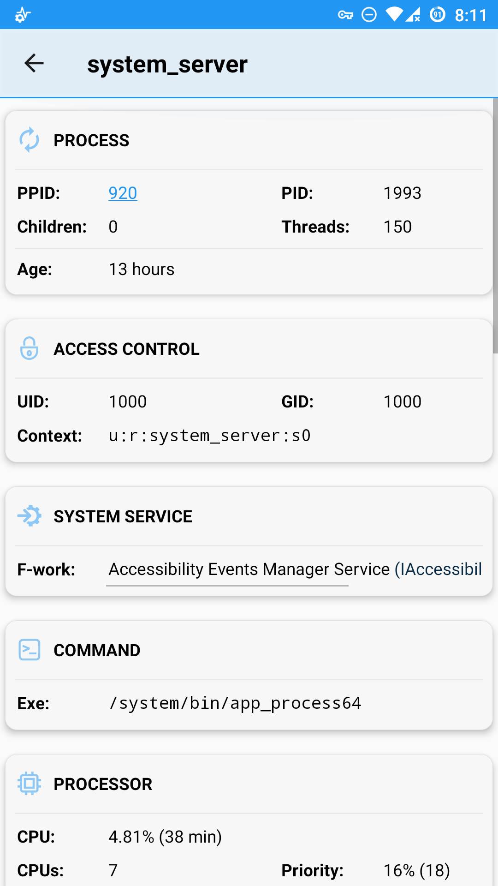 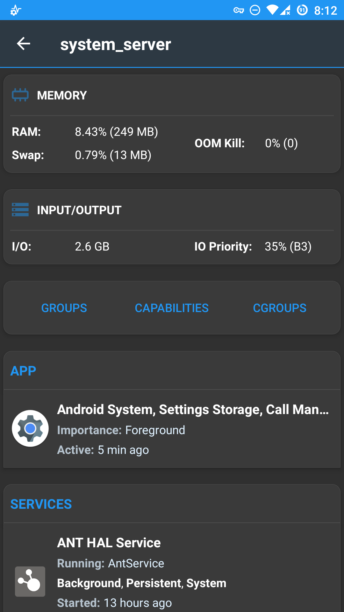  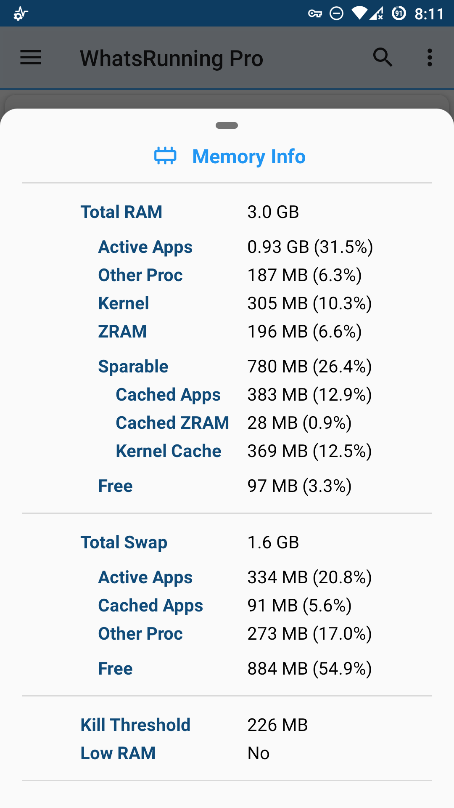 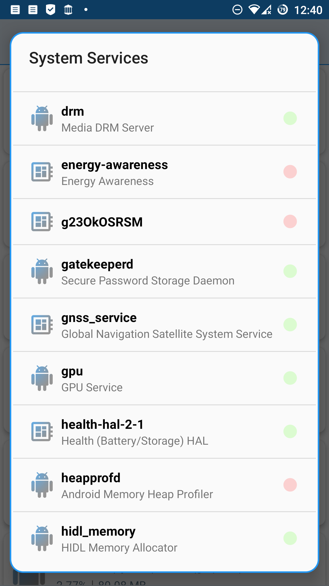 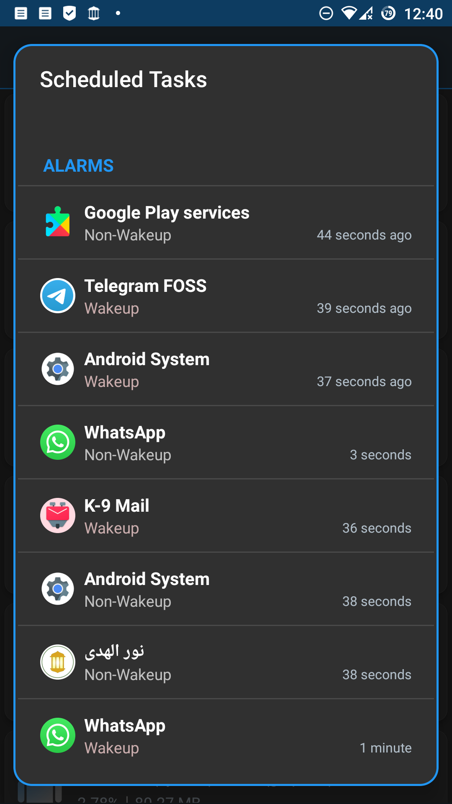 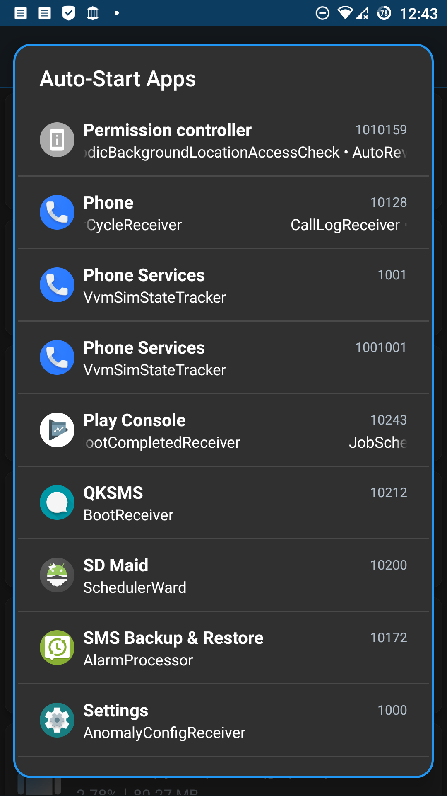 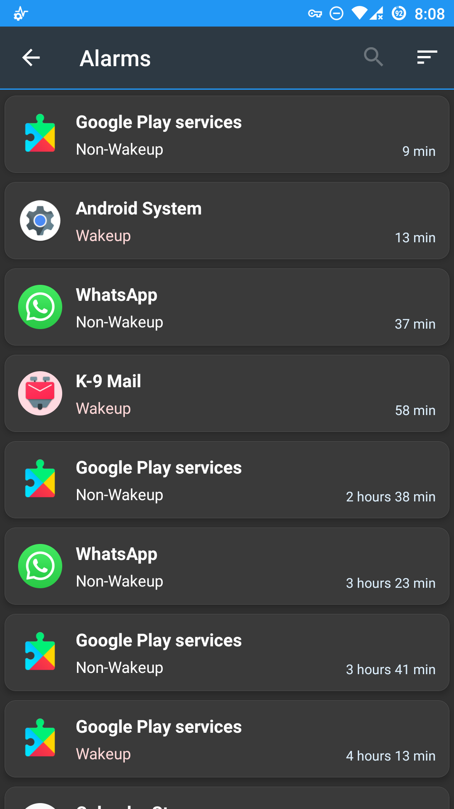 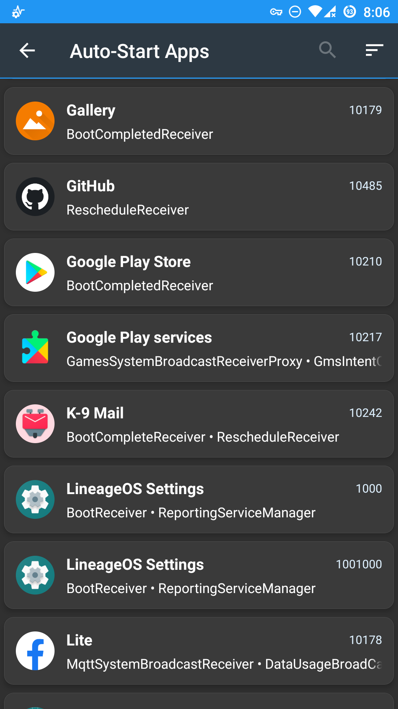 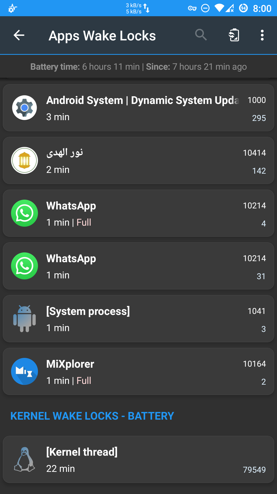 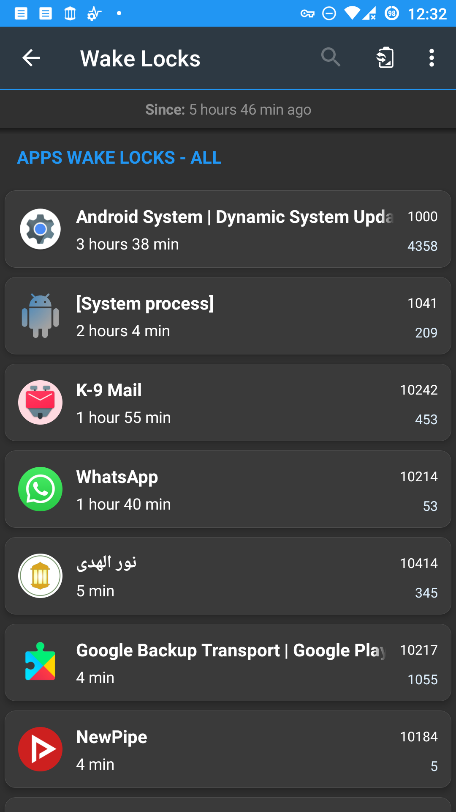 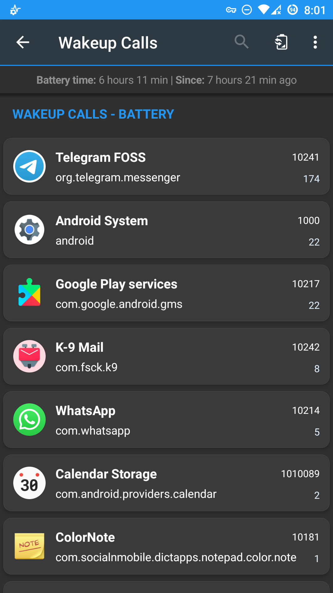  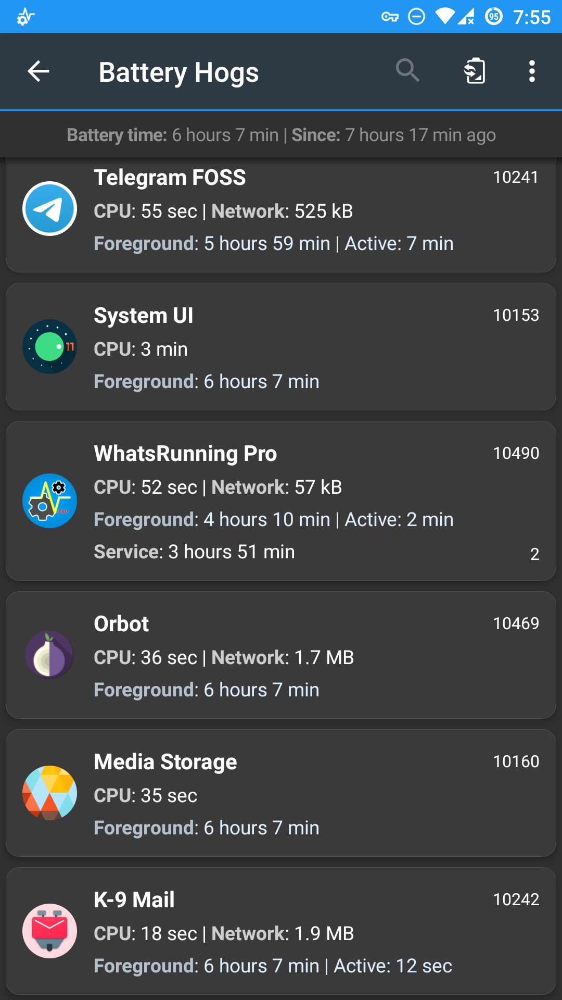

## Want To Reach Us?

<table>
    <td>&nbsp;<a href="https://t.me/WhatsRunning"> Telegram</a>&nbsp;</td>
    <td><a href="https://forum.xda-developers.com/t/app-7-0-whatsrunning-know-whats-running-on-your-device.4386093/"> XDA Thread</a></td>
    <td>&nbsp;&nbsp;&nbsp;&nbsp;<a href="mailto:mirfatif.dev@gmail.com"> Email</a>&nbsp;&nbsp;&nbsp;&nbsp;</td>
</table>

